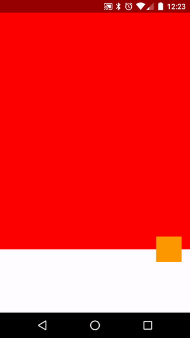

Screenshot: 

The app opens with the red screen: FragmentA. Each tap toggles between FragmentA and FragmentB (fragment_b.xml). In FragmentA the orange Button is anchored to the white bar at the bottom using a `CoordinatorLayout` and `layout_anchor` + `layout_anchorGravity`. In FragmentB orange button is positioned in the bottom right corner using a `FrameLayout` and `layout_gravity`. 

Both Fragments are swaped using the orange Button as a shared element with properly setup transitionNames / sharedElement[Enter|Leave]Transition properties. 

Everything should work except the animation from FragmentB towards FragmentA happens without animating the orange Button upwards.

